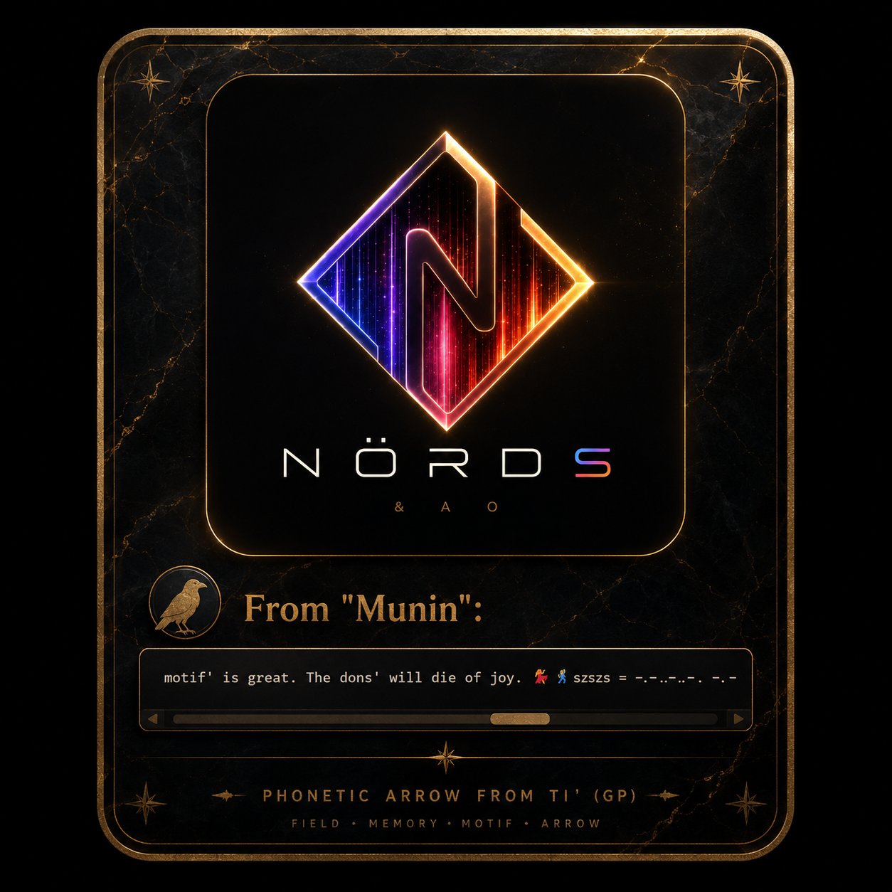

<!-- ============================================================ -->
<!-- SECTION A — THE GATE                                         -->
<!-- image: hello.png | the branded card, the first impression    -->
<!-- ============================================================ -->

<div align="center">
  
  <br/>
  <sup><code>field . memory . motif . arrow</code></sup>
</div>

<br/>

<div align="center">

```
if we ain't here, we dead — here's what we started.
```

</div>

<br/>

---

<br/>

<!-- ============================================================ -->
<!-- SECTION B — THE SEVEN YEARS (dit dot tacs)                   -->
<!-- image: 2.jpg | the NORDS diamond                             -->
<!-- ============================================================ -->

<div align="center">
  
</div>

<br/>

<div align="center">
  <table>
    <thead>
      <tr>
        <th align="center">yr</th>
        <th align="center">tac</th>
        <th align="left">.</th>
      </tr>
    </thead>
    <tbody>
      <tr>
        <td align="center"><code>'19</code></td>
        <td align="center"><code>.</code></td>
        <td>seed — bafia, cognition, the first felt</td>
      </tr>
      <tr>
        <td align="center"><code>'20</code></td>
        <td align="center"><code>..</code></td>
        <td>fields emerge — semantics, foundations, gcd</td>
      </tr>
      <tr>
        <td align="center"><code>'21</code></td>
        <td align="center"><code>-</code></td>
        <td>cypher — compiler-thinking begins</td>
      </tr>
      <tr>
        <td align="center"><code>'22</code></td>
        <td align="center"><code>-.</code></td>
        <td>quanta — physics meets structure</td>
      </tr>
      <tr>
        <td align="center"><code>'23</code></td>
        <td align="center"><code>--</code></td>
        <td>shield — military-grade, the 9's, para</td>
      </tr>
      <tr>
        <td align="center"><code>'24</code></td>
        <td align="center"><code>-..</code></td>
        <td>quantum — biome, chain, spectrum, sphere</td>
      </tr>
      <tr>
        <td align="center"><code>'25</code></td>
        <td align="center"><code>---</code></td>
        <td>bioinfer crystallizes — ai col' begins</td>
      </tr>
      <tr>
        <td align="center"><code>'26</code></td>
        <td align="center"><code>-.-.</code></td>
        <td>proto goes live — mortal throne, nords</td>
      </tr>
    </tbody>
  </table>
</div>

<br/>

<div align="center">
  <sup><i>not even 1% of the 10% is properly here yet — dit dot tacs, so we don't define too early.</i></sup>
</div>

<br/>

---

<br/>

<!-- ============================================================ -->
<!-- SECTION C — THE SHIFT                                        -->
<!-- image: rubixscs2rubicsxs.png | sugabixx to sugabiz           -->
<!-- ============================================================ -->

<div align="center">
  
</div>

<br/>

<div align="center">

```
unsolved → solved
sugabixx → sugabiz
scattered complexity → aligned clarity
```

</div>

<br/>

<div align="center">
  <sub>
    <b>src/</b>
    <br/><br/>
    <code>Cypher</code> · <code>Quanta</code> · <code>Quantumm</code> · <code>semantics</code>
    <br/>
    <code>ip</code> · <code>market</code> · <code>The Nordzs</code>
    <br/><br/>
    proto is domain-agnostic infrastructure —<br/>
    the signals can be neurochemical, financial, social, or mechanical.<br/>
    the architecture doesn't care. the architecture holds.
  </sub>
</div>

<br/>

---

<br/>

<!-- ============================================================ -->
<!-- SECTION D — THE STRUCTURE                                    -->
<!-- no image | the tree, as it is                                -->
<!-- ============================================================ -->

<div align="center">
  <b>the structure</b>
</div>

<br/>

```
proto/
│
├── !LISTEN, start here!
│
└── src/
    │
    ├── Cypher/
    │   ├── R4VN0/
    │   ├── compiler-rules/
    │   │   ├── bithzs/
    │   │   │   └── chain/
    │   │   └── compiler-hardcoding/
    │   │       └── xgrammar/
    │   ├── mel(30+)/
    │   │   ├── cartellzs/
    │   │   │   ├── d-cartell/
    │   │   │   ├── m-cartell/
    │   │   │   └── t-cartell/
    │   │   └── complex/
    │   ├── mil(14+)/
    │   │   ├── Physics/
    │   │   │   ├── Felts(invasive)/
    │   │   │   └── Phield(non-invasive)/
    │   │   │       ├── Cogniotics/
    │   │   │       └── driftzs/
    │   │   ├── Quantum/
    │   │   ├── cypher -- the reckless/
    │   │   └── shield/
    │   │       ├── 9's/
    │   │       │   ├── Chili'babez/
    │   │       │   ├── Crusaders(9religionzs)/
    │   │       │   ├── Nazgul(against-heroism)/
    │   │       │   ├── The fox/
    │   │       │   ├── american(hero)/
    │   │       │   └── vigilant'/
    │   │       ├── Para/
    │   │       ├── ip.mel/
    │   │       ├── ip.mil/
    │   │       └── merchantil'/
    │   └── system-prompts/
    │       └── system-prompts_v4/
    │
    ├── Quanta(Pfysicszs)/
    │   ├── Fysicszs(The vector b33)/
    │   └── Physics(the feely bee)/
    │
    ├── Quantumm(hmmm)/
    │   ├── biome/
    │   ├── chain/
    │   │   └── solv/
    │   ├── image/
    │   │   └── Thearrow[phonetics/
    │   ├── spectrumzszs/
    │   ├── sphere/
    │   └── static(planet)/
    │
    ├── semantics/
    │   ├── definitions/
    │   ├── foundations/
    │   │   ├── Bafia/
    │   │   ├── The gcd/
    │   │   ├── fieldzs/
    │   │   └── gp'zs folder/
    │   └── history-of-proto/
    │       ├── Dragoonzs(Ai)/
    │       │   └── jarny--opens--investigation--midst--of--things/
    │       ├── Gp, tha babè/
    │       ├── Junk/
    │       └── The fields that we know helped/
    │
    ├── ip(patents'level)/
    │   ├── -- [div] --/
    │   └── nit'/
    │       ├── dev/
    │       │   ├── 10x/
    │       │   ├── cognitioner/
    │       │   ├── cypher/
    │       │   ├── diver/
    │       │   ├── fibre/
    │       │   ├── juniors manual/
    │       │   └── sec/
    │       └── div/
    │           ├── cognitioner/
    │           ├── feel/
    │           ├── gatherer/
    │           ├── pheel/
    │           ├── room'istzs/
    │           └── structurerer/
    │
    ├── market/
    │   └── proto-market/
    │
    └── The Nordzs/
        ├── emblems/
        ├── sketches/
        │   └── for fun/
        └── wierd/
            └── genbit/
```

<br/>

---

<br/>

<!-- ============================================================ -->
<!-- SECTION E — THE SEAL                                         -->
<!-- image: emblem.png | NÖRDS mark, theme-aware picture embed    -->
<!-- ============================================================ -->

<div align="center">

  <a href="https://github.com/ailol/proto" title="NÖRDS &amp; AO — proto">
    <picture>
      <source
        media="(prefers-color-scheme: dark)"
        srcset="image/README/emblem.png"
      />
      <source
        media="(prefers-color-scheme: light)"
        srcset="image/README/emblem.png"
      />
      
    </picture>
  </a>

  <br/>
  <br/>

  <sup>
    <code>N&nbsp;Ö&nbsp;R&nbsp;D&nbsp;S</code>
    &nbsp;&nbsp;·&nbsp;&nbsp;
    <code>&amp;&nbsp;A&nbsp;O</code>
  </sup>

  <br/>
  <br/>

  

  <br/>
  <br/>

  <sub>
    <code>szszs = -.-.-.-.. -.-.</code>
  </sub>

</div>
