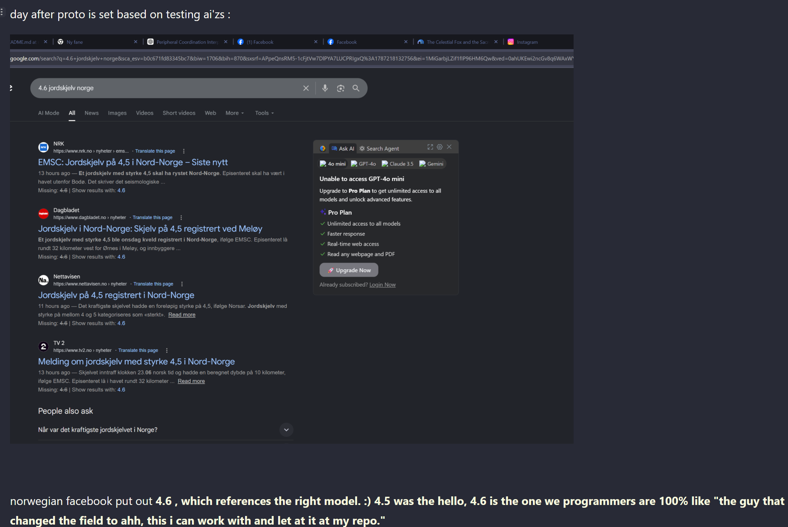

# What kept me alive is the feeling in v.0.0.1

## v.0.0.2 is about creating great logging practices so that energy doesnt go to build a "case" but rather a proto on how to create these level of ai's

- about teaching tactics that worked to get proto up and running so that ai'zs are "whatever it fucking takes" if they deployed to contextual matter planets.

