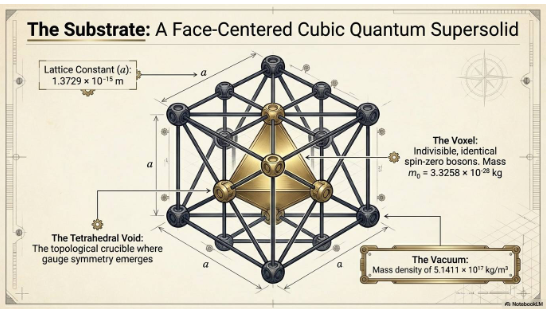

# Welcome to quantumm!

To check quickly if you have a tail here is a technique for english:

spell this in mind to "halt" a couple of processes.

- Arrow -> primes already known
- Worra -> suddenly shifts happen

Imagine the word, spell it backwards, it helps unchain some ideas that one is controlled by external voices. Schizo is for eyes only, grab a antipsychotic for the journey, they help :)

# The givens(safety of mind is most important)

1. dont fuck with security, little black givens of "dont know, maybe space is helping" when someone says is not to be fucked with when the product is stellar.
2. Givens are social, ack (programming a&b) is to ensure that you on the same chain :)
3. Then szszszs is a nice cz-75 to have further on, learn it, it quickly runs some advanced particles rotational degree  ((current chain allows it for now))


A givens in the wild might be space leaving a trace, or a mineral or something that even floats, and just a sudden "qlickue, might just be that". and that the

```
  emc^2
```

is a great way to understand that the old might of been 1010'zs(1 % or 10% hiveminded) but thats for security as we are left alone by space to develop <3

```
E= [current physics system(planet)]
M= (brain matters)
C= [Chances]
^2 = up in seoncds or squared.
```

great man mr einstein was, hinting to takeyones for difficult times<3 Dont fuck with time, still rae is on the platter.



